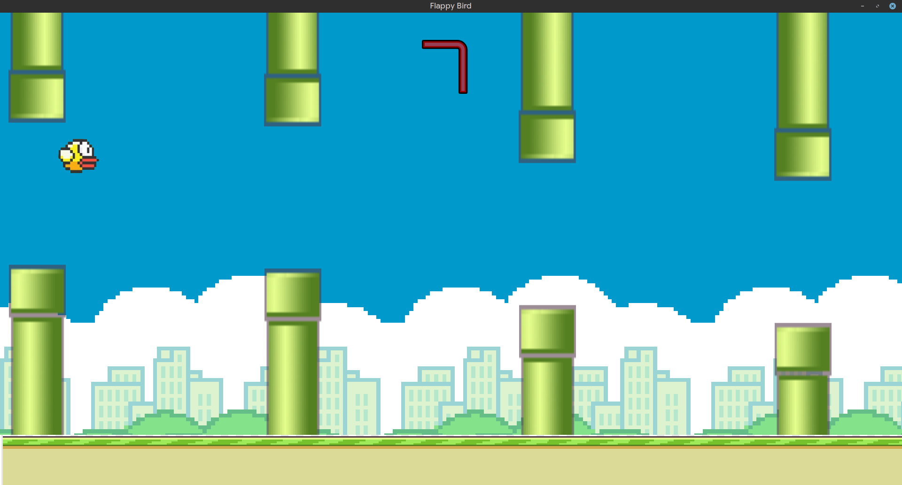

# Flappy Bird using SFML

A simple **Flappy Bird game** built in **C++** using the **SFML** library.
Fly the bird through randomly generated pipes, avoid collisions, and track your score!

## Purpose

The purpose of this project is to learn and understand how to make a 2D game and thereby, act as a pathway for learning how to make 3D games.

## Screenshot of Gameplay



## Features

- Bird controlled with the **Space** key to flap.  
- Randomly generated pipes with gaps.  
- Collision detection with pipes and ground.  
- Score display with a custom font (Orbitron).  
- Fullscreen support with a scrolling background and moving ground.

## Controls

- **Space**: Flap the bird upwards.  
- **Close window / ESC**: Exit the game.

## Dependencies

- **C++17 or later**  
- [**SFML 2.5+**](https://www.sfml-dev.org/)  
  - Modules used: Graphics, Window, System  

## How to Compile and Run

### Option 1: Using g++

1. **Compile the source file:**

```bash
g++ -c main.cpp
```

2. **Link and create the executable:**

```bash
g++ main.o -o FlappyBird -lsfml-graphics -lsfml-window -lsfml-system
```

Run the game:

```bash
./FlappyBird
```

### Option 2: Using CMake with Ninja

1. **Create a build directory and generate build files:**

```bash
cmake -G Ninja -S . -B build
```

2. **Build the project:**

```bash
cmake --build build
```

3. **Run the executable (usually inside build/):**

```bash
./build/flap
```
